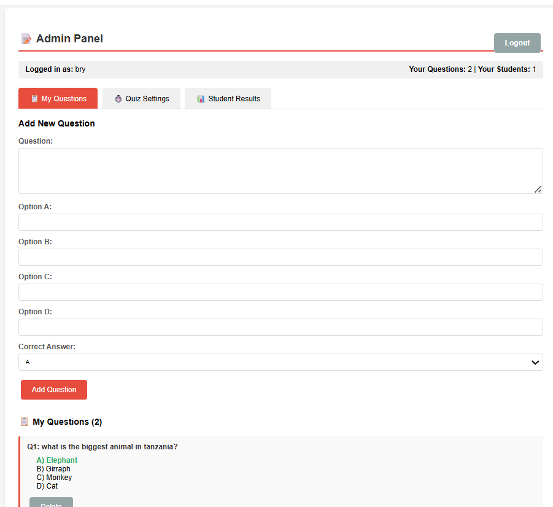

# Online Quiz Management System

A web-based quiz management platform built with Python and Flask, designed for conducting online assessments for students and interviews.

> **Note:** This is the first version (v1.0) of the application. Future updates and enhancements are planned.

## 📋 Overview

This system provides a comprehensive solution for creating, managing, and taking online quizzes. It supports multiple administrators and includes features for automated quiz handling, result tracking, and data export capabilities.

## ✨ Features

- **Multi-Admin Support** - Multiple administrators can manage the system simultaneously
- **Admin Registration System** - Secure registration and authentication for administrators
- **Quiz Timer** - Configurable time limits for each quiz session
- **Auto-Submit on Timeout** - Automatically submits quizzes when time expires to ensure fair assessment
- **Excel & PDF Export** - Export quiz results and reports in multiple formats for easy sharing and record-keeping
- **User-Friendly Interface** - Clean and intuitive design for both administrators and quiz takers

## 📸 Screenshots

### Home View


### Admin Dashboard


### Admin - Setting Timer


### Student Interface


### Student Quiz View


### Admin - Students Results


## 🛠️ Technologies Used

- **Python** - Core programming language
- **Flask** - Web framework for building the application
- **HTML/CSS** - Frontend interface

## 🎯 Use Cases

- Educational institutions for student assessments
- Online interview platforms
- Training and certification programs
- Knowledge evaluation tools

## 🚀 Getting Started

### Prerequisites
- Python 3.x installed on your system
- Flask framework

### Installation

1. Clone the repository:
```bash
git clone https://github.com/brys-123/Online-quiz-management.git
```

2. Navigate to the project directory:
```bash
cd Online-quiz-management
```

3. Install required dependencies:
```bash
pip install flask
```

4. Run the application:
```bash
python app.py
```

5. Open your browser and navigate to `http://localhost:5000`

## 🔮 Future Enhancements

Planned features for upcoming versions:
- Database integration for persistent data storage
- Advanced question types (essay, fill-in-the-blank)
- Real-time quiz monitoring
- Enhanced security features
- Mobile responsive design improvements

## 👤 Author

**Bryson Nkinda**
- GitHub: [@brys-123](https://github.com/brys-123)
- Email: brysonnkinda@gmail.com

## 📝 License

This project is available for educational and personal use.
